# ASmdead

ASmdead is a custom PE packer and memory execution tool designed to obscure execution flow using advanced techniques like Call Stack Spoofing and PE Exception Directory manipulation. It aims to bypass dynamic analysis and EDR telemetry by forging legitimate-looking thread call stacks.

## Features

- **PE Packing & Encryption:** Encrypts the target payload and unpacks it dynamically in memory.
- **Call Stack Spoofing:** Manipulates the x64 stack to hide the true origin of execution, presenting a benign call stack to any observing processes or hooks.
- **Exception Directory Parsing:** Uses valid `RUNTIME_FUNCTION` structures from loaded modules to construct plausible stack frames that survive stack unwinding checks.

## Architecture & How It Works

### 1. x64 Stack Frame Manipulation
To successfully spoof the call stack, ASmdead conforms to the strict Windows x64 calling convention. It manually crafts the stack frames in assembly (`ASM/stub.asm`), ensuring that the mandatory 32-byte shadow store (home space) and non-volatile registers are correctly preserved and aligned.

<div align="center">
  
  <br><i>Typical x64 stack frame layout and mapping of RUNTIME_FUNCTION structures.</i>
</div>

### 2. PE Exception Directory Handling
When Windows needs to unwind the stack (for exceptions or stack-walking telemetry), it relies on the `RUNTIME_FUNCTION` array located in the PE file's `.pdata` section (Exception Directory). ASmdead parses these structures to locate valid functions and their unwind codes, allowing it to accurately simulate legitimate module frames.

### 3. Call Stack Spoofing Algorithm
The core of the evasion involves a complex unwinding algorithm that sets up multiple fake frames (First Frame, Second Frame, Desync Frame, Stack Pivot Frame) and creates fake return addresses pointing to legitimate Windows API functions (like `ntdll!RtlUserThreadStart` and `kernel32!BaseThreadInitThunk`). 

By bridging the actual execution through a JMP/ROP gadget (e.g., `JMP [RBX]`), the true payload execution is hidden. To an EDR analyzing the thread, the call tree appears entirely clean and sourced from legitimate Windows binaries.

<div align="center">
  
  <br><i>Call Stack Spoofing Architecture: Setting up fake frames, pivoting the stack, and handling the unwinding algorithm.</i>
</div>

## Building the Project

The project is built using CMake and Ninja. Ensure you have the MSVC build tools installed.

```cmd
mkdir build
cd build
cmake -G Ninja ..
ninja
```

## Disclaimer
This project is for educational and cybersecurity research purposes only. Do not use it for unauthorized or malicious activities.
